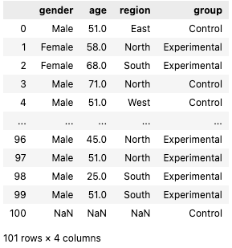
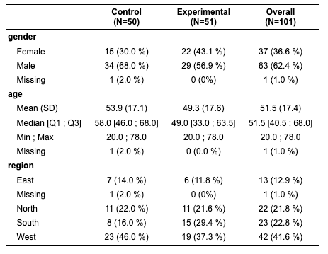
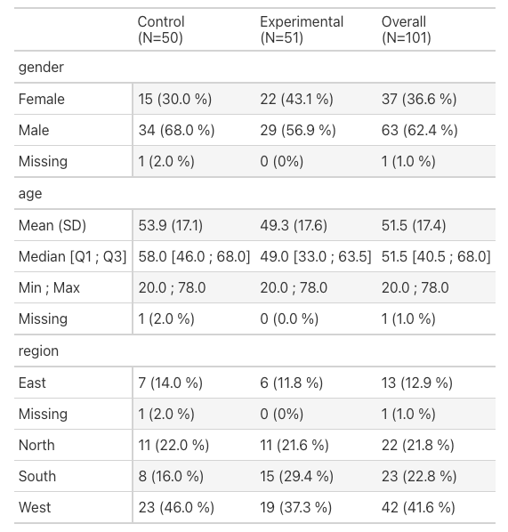

# Welcome to PySumaries documentation!

PySummaries is a Python package to easily produce table summarizations
from pandas dataframes.

For more detailed information, please look at the [documentation](https://genentech.github.io/pysummaries/)

## Installation
 
You can install the package with pip:

```
pip install pysummaries
```

## QuickStart

Let's say we have a dataframe with some data we want to summarize. 
Let's take a look at the data:

```python
import pandas as pd
from IPython.display import display, Markdown

from pysummaries import get_table_summary, get_sample_data

df = get_sample_data()
display(df)
```



Now, let's do a table one stratifying by group 

We can use two backends for the html representation: a pysummaries native representation, 
and one using the popular [great_tables](https://posit-dev.github.io/great-tables/articles/intro.html) package

Let's start first with the PySummaries native backend:

```python
summary_table = get_table_summary(df, strata='group', backend='native')  
display(summary_table)
```



And now, let's try the great tables backend!

```python
summary_table = get_table_summary_gt(df, strata='group', backend='gt')  
display(summary_table)
```



You can customize your tables! For this and more options, please look at the [documentation](https://genentech.github.io/pysummaries/)

